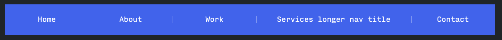
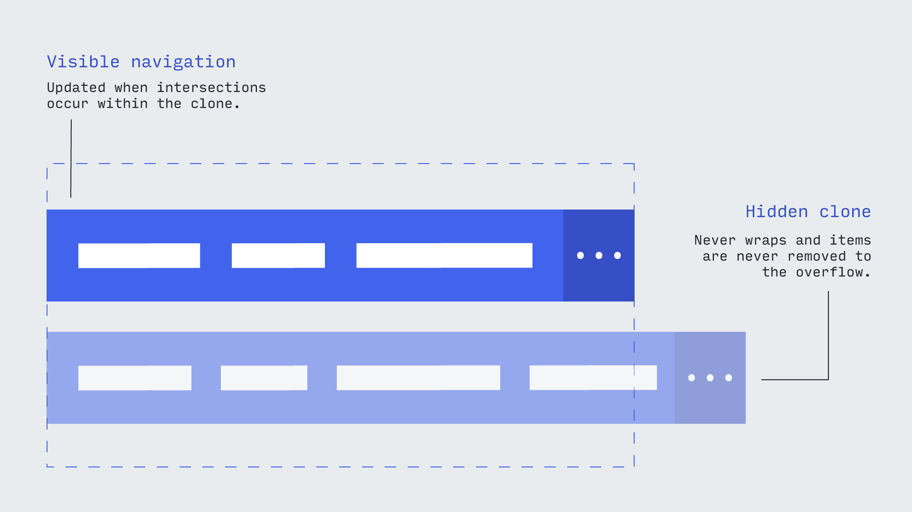

# priorityPlus


[](https://github.com/semantic-release/semantic-release)

A modern implementation of the [priority plus](https://css-tricks.com/the-priority-navigation-pattern/) navigation pattern.



You can see a demo on the [landing page](https://jayfreestone.github.io/priority-plus/).

There's also a Glitch pen [available here](https://priority-plus-demo.glitch.me/#) with a different, alternatively styled example. Check out the [source](https://glitch.com/edit/#!/priority-plus-demo).

**The short stuff**:

- Vanilla JS, dependency free. Available as an ES6 module, CJS module, or a UMD bundle.
- Uses the [`IntersectionObserver` API](https://developer.mozilla.org/en-US/docs/Web/API/Intersection_Observer_API) instead of width-based calculations.
- Toggles the appropriate [WAI-ARIA](https://www.w3.org/WAI/standards-guidelines/aria/) attributes to remain accessible.
- Provides a class hook to style the menu differently when all items are in the overflow/hidden.
- Provides a way to update the overflow toggle button with the hidden item count.

Comes in at under 2.5kb after `gzip`.

## What is it

As [Brad](http://bradfrost.com/blog/post/complex-navigation-patterns-for-responsive-design/#priority-plus) explains:

> The Priority+ pattern...exposes what’s deemed to be the most important navigation elements and tucks away less important items behind a “more” link. The less important items are revealed when the user clicks the “more” link.


This library implements the pattern by fitting as many navigation items as possible into the 'primary' navigation, and then automatically moving the rest into a dropdown. If more space becomes available, the links are gradually re-instated into the primary navigation.

There are already examples of libraries that follow this behaviour, such as [PriorityNav.js](http://gijsroge.github.io/priority-nav.js/). However most of these were written before the advent of modern browser APIs such as the [`IntersectionObserver`](https://developer.mozilla.org/en-US/docs/Web/API/Intersection_Observer_API), operating by measuring the parent and child elements, then calculating how many items can (and cannot) fit.

This library, however, uses an `IntersectionObserver` to avoid costly measurements, instead relying on the browser to tell us when an element 'intersects' with the edge of the viewport. The result is faster - and generally snazzier.

## How it works

When initiated, the library creates a new version of your navigation with the required markup, including a toggle button:

```html
<div data-main class="p-plus">
  <div class="p-plus__primary-wrapper">
    <ul data-primary-nav class="p-plus__primary" aria-hidden="false">
      <li data-nav-item>
        <a href="#">Home</a>
      </li>
      <!-- etc -->
    </ul>
  </div>
  <button data-toggle-btn class="p-plus__toggle-btn" aria-expanded="false">
    <span aria-label="More">+ (0)</span>
  </button>
  <ul data-overflow-nav class="p-plus__overflow" aria-hidden="true"></ul>
</div>
```

It also *clones* this version, so there are actually two versions of the new navigation living on the page. One is the visible navigation that the library will add and remove elements from, and the other is an invisible copy that always retains the full set of nav items (which are forced to overflow horizontally).



As the items overflow, they trigger the parent's `IntersectionObserver`. This means we can easily detect when (and in which direction) a new nav item clashes with the outer boundary of the navigation.

Once we detect a collision, we store which navigation it should now belong to (primary or overflow) and update both in the DOM.

## Browser support

This library is designed to work with modern browsers, and as such makes no promises when it comes to the likes of InternetExplorer.

However, provided you bring-your-own support for the `IntersectionObserver` API and include the library in a transpiled bundle, there's no (obvious) reason it wouldn't work in anything that supports `Map`/`WeakMap`.

## Installation

Install from [NPM](https://www.npmjs.com/package/priority-plus):

```
npm install priority-plus
```

Or use a CDN if you're feeling old-school:

```html
<link rel="stylesheet" href="https://cdn.jsdelivr.net/npm/priority-plus/css/priority-plus.css">
<!-- Will be available globally as priorityPlus -->
<script defer src="https://cdn.jsdelivr.net/npm/priority-plus/dist/priority-plus.umd.js"></script>
```

## Setup

You can create a new instance by passing in an `HTMLElement` that is the direct parent of the navigation items:

```html
<nav>
  <ul class="js-p-target">
    <li><a href="/">Home</a></li>
    <li><a href="/">About</a></li>
    <li><a href="/">Work</a></li>
    <li><a href="/">Services longer nav title</a></li>
    <li><a href="/">Contact</a></li>
  </ul>
</nav>
```

```css
// Doesn't have to be SASS, just ensure the CSS is included.
@import "../node_modules/priority-nav/css/priority-plus";
```

```javascript
import priorityPlus from 'priority-plus';
priorityPlus(document.querySelector('.js-p-target'));
```

It's important that the element is the *immediate* parent, since internally the library iterates over the children as the basis for the new navigation items.

## Methods

The following methods are available on a new instance, e.g.:

```javascript
const inst = priorityPlus(document.querySelector('.js-p-target'));
console.log(inst.getNavElements());
```

### `getNavElements(): { [key: string]?: HTMLElement|HTMLElement[] }`

Retrieves an object containing references to each element in the primary generated navigation.

### `on(eventType: string, cb: Function)`

Sets up an event listener on the instance (not the target element). See [events](#events) for a list of the events that are triggered.

Example:
```javascript
inst.on('itemsChanged', () => console.log('Items changed'));
```

### `off(eventType: string, cb: Function)`

Destroys an event listener.

Example:
```javascript
const callback = () => console.log('Items changed');
inst.on('itemsChanged', callback);
// etc
inst.off('itemsChanged', callback);
```

### `setOverflowNavOpen(open: boolean)`

Opens or closes the overflow navigation programatically.

Example:
```javascript
inst.setOverflowNavOpen(true);
```

### `toggleOverflowNav()`

Opens the overflow nav if closed, closes it if open.

Example:
```javascript
inst.toggleOverflowNav();
```

## Options

### `collapseAtCount`

If you'd like to collapse into the overflow when the primary navigation becomes depleted, you can do with the `collapseAtCount` option:

```javascript
priorityPlus(document.querySelector('.js-p-target'), {
  collapseAtCount: 2,
});
```

The above will move all menu items into the overflow if only two can 'fit' into the primary. This is essentially a way to avoid orphan nav items.

### Classes
If you'd like to override the default classes, you can pass in a `classNames` object like so:

```javascript
priorityPlus(document.querySelector('.js-p-target'), {
  classNames: {
    // Will override the p-plus class.
    // Other classes will be un-touched.
    wrapper: ['my-p-plus'],
  },
});
```

Each class override must be passed as an array.

| Option | Default  | Explanation |
|:--------|:----------|:-------------|
| <pre>`container`</pre> | <pre>`p-plus-container`</pre> | This is the wrapper that collects both 'clones' of the navigation. Its purpose is to provide a way to obscure the clone.
| <pre>`main`</pre> | <pre>`p-plus`</pre> | The class applied to each of the top-level navigation wrappers. Be aware it applies to both the clone and the visible copy.
| <pre>`primary-nav-wrapper`</pre> | <pre>`p-plus__primary-wrapper`</pre> | Outer wrapper for the 'primary' (non-overflow) navigation.
| <pre>`primary-nav`</pre> | <pre>`p-plus__primary`</pre> | Inner wrapper for the 'primary' (non-overflow) navigation.
| <pre>`overflow-nav`</pre> | <pre>`p-plus__overflow`</pre> | Wrapper for the overflow navigation.
| <pre>`toggle-btn`</pre> | <pre>`p-plus__toggle-btn`</pre> | Applied to the dropdown menu toggle button.

### Templates 

#### `innerToggleTemplate(String|Function)`

**Default:** 'More'

Overrides the inner contents of the 'view more' button. If you pass a string, then it will only render once, but if you pass it a function it will re-render every time the navigation is updated.

The function receives an object containing two parameters, `toggleCount` (the number of items in the overflow) and `totalCount` (which is the total number of navigation items).

Example:

```javascript
priorityPlus(document.querySelector('.js-p-target'), {
  innerToggleTemplate: ({ toggleCount, totalCount }) => `
    Menu${toggleCount && toggleCount !== totalCount ? ` (${toggleCount})` : ''}
  `,
});
```

Be aware that if you alter the width of the element by changing its content, you could create a loop wherein the button updates, triggering a new intersection, which causes the button to update (and so on). Therefore it's probably a good idea to apply a width to the button so it remains consistent.

## Events

Arguments are provided via the `details` property.

| Name | Arguments  | Description |
|:------|:----------|:----------|
| `showOverflow` | None | Triggered when the overflow nav becomes visible.
| `hideOverflow` | None | Triggered when the overflow nav becomes invisible.
| `itemsChanged` | `overflowCount` (The number of items in the overflow nav) | Triggered when the navigation items are updated (either added/removed).

## Defining a 'mobile' breakpoint

You should never have to base the amount of visible navigation items visible on the viewport size.

However, if you would like to break (early) to the 'mobile' view at a pre-defined point, you can do so with just CSS.

Simply add a rule that causes the first item in the navigation to expand beyond the viewport, like so:

```css
@media (max-width: 40em) {
  .p-plus__primary > li:first-child {
    width: 100%;
  }
}
```

## Troubleshooting

### Flex nav collapsing

If your menu is part of an auto-sized flex-child, it will probably need a positive `flex-grow` value to prevent it reverting to its smallest form. For instance:

```html
<header class="site-header">
  <h1 class="site-header__title">My great site title</h1>
  <nav class="site-header__nav">
    <ul class="site-nav js-site-nav">
      <li><a href="#">Services</a></li>
      <li><a href="#">Thinking</a></li>
      <li><a href="#">Events</a></li>
    </ul>
  </nav>
</header>
```

```css
.site-header {
  display: flex;
  align-items: center;
}

/**
 * Prevents nav from collapsing.
 */
.site-header__nav {
  flex-grow: 1;
}
```
